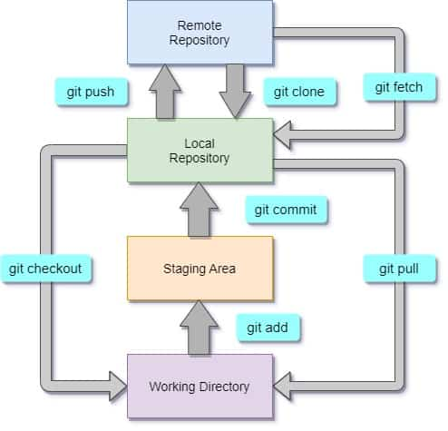

#Setup git environment
##Set Username
Assign a username which will be used for each commit globally:
```
git config --global user.name "sepydev"
```

##Set Email Address
Assign an email address which will be used for each commit globally:
```
git config --global user.email "mrprocs@gmail.com"
```

## Set Default Editor
You can set the editor to the editor of your choice either by changing the $EDITOR environment variable or with the core.editor configuration target,
```
git config --global core.editor vim
```


## To get remote branch without create branch in local use this command
```
git fetch <remote> <remote branch>:<local branch>
```
## To reset local brach to the remote branch 
```
git fetch <remote> <branch>
git checkout <branch>
git reset --hard <remote>/<branch>
```
## To see all remote branches 
```
git branch --all
```


# Git WorkFlow
### The following image summarizes the basic git workflow:
Git Workflow | Git Lifecycle | Gitflow Tutorial
Let us explore the different git workflows in this image:




